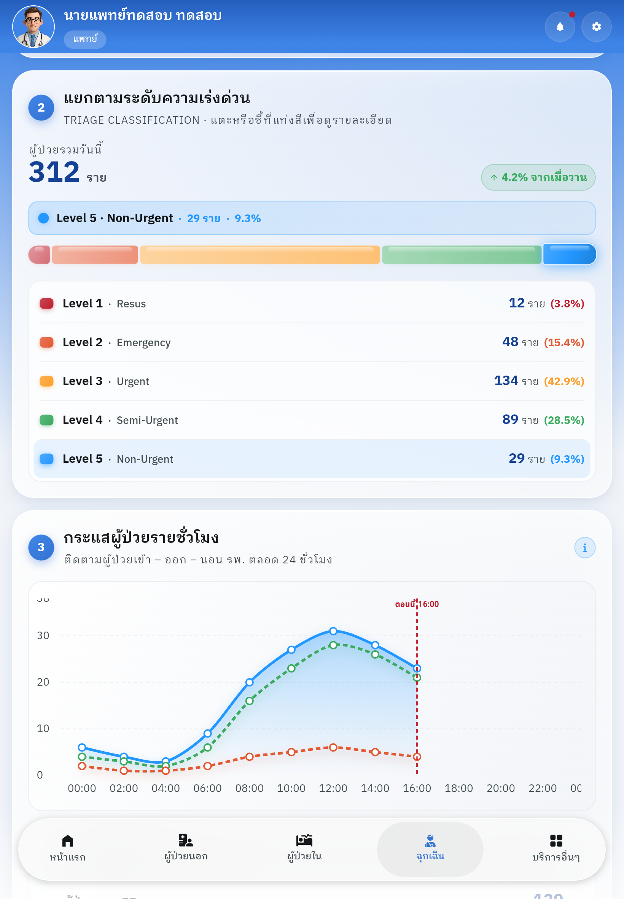
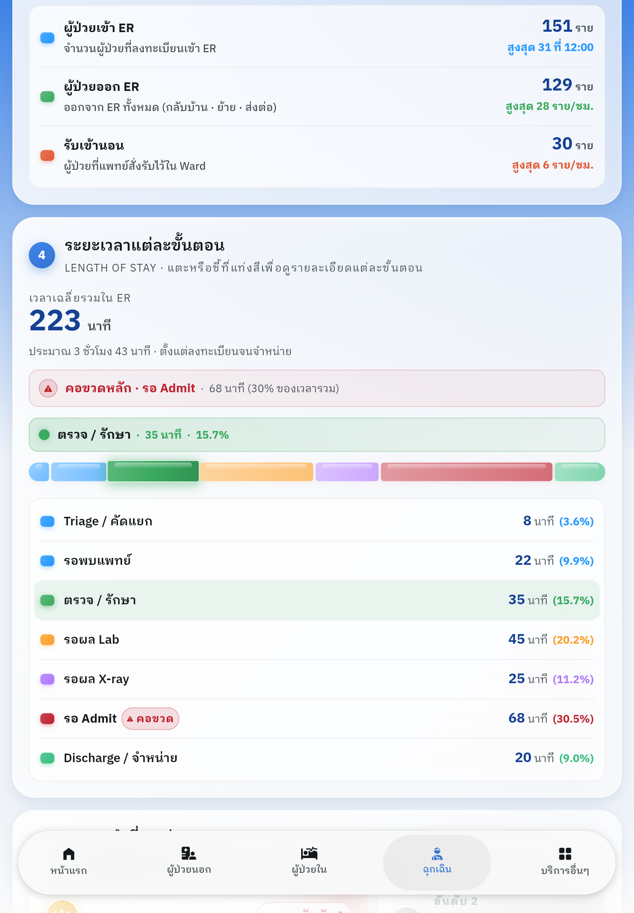
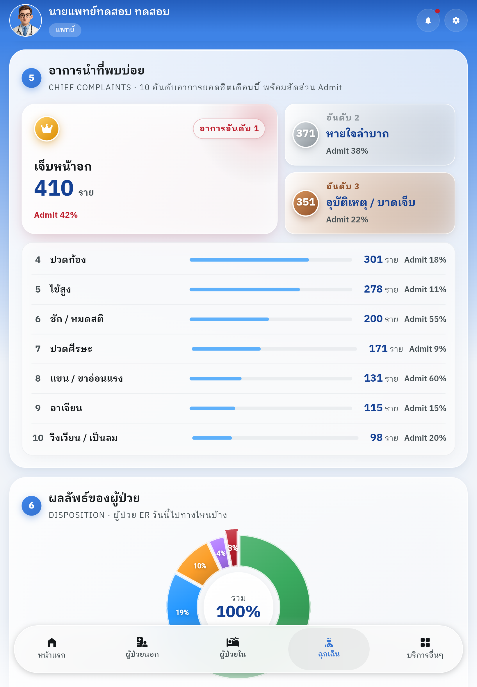

# HOSxP Plus V5 — ER Dashboard

UX/UI prototype for the Emergency Room (ER) executive dashboard of a Thai hospital, built on top of the HOSxP Plus V5 Flutter app.

**Live demo:** https://bms-uxui.github.io/bms-hosxp-plus/

## Scope

This repo is focused on **visual design + interaction prototyping**. Data is mocked locally; Supabase wiring is out of scope for this phase.

Covered dashboard sections (6 of 10 from the spec):

1. **KPI Overview** — 8 key metrics, responsive 1/2/4-column grid
2. **Triage Classification** — 5-level segmented bar + interactive legend
3. **Patient Flow** — 24h horizontally scrollable line chart with current-time indicator
4. **Length of Stay (LOS)** — 7-step journey as segmented bar with bottleneck highlight
5. **Chief Complaints** — Hero + top-3 + detailed list for top-10 complaints
6. **Disposition** — Donut chart with interactive legend

## Design direction

- **Glassy + 3D** aesthetic: translucent gradients, `BackdropFilter` blur, layered shadows, gloss strips
- **Thai-primary** UX writing, supportive English secondary labels
- Tab-based navigation with dedicated **แดชบอร์ด** tab alongside the patient list tabs

## Screenshots

### ตัวชี้วัดสำคัญ (KPI Overview)


### แยกตามระดับความเร่งด่วน · กระแสผู้ป่วยรายชั่วโมง


### ระยะเวลาแต่ละขั้นตอน (Length of Stay)


### อาการนำที่พบบ่อย · ผลลัพธ์ของผู้ป่วย


## Stack

- Flutter 3.41.5 / Dart 3.11.3 (stable)
- `fl_chart` for bar / line / pie charts
- `flutter_staggered_grid_view` for the KPI grid
- Hosted as a static build on GitHub Pages; auto-deployed by a GitHub Actions workflow on every push to `main`

## Running locally

```bash
flutter pub get
flutter run -d chrome          # or: flutter run -d web-server --web-port=8787
```

## Deploying

Push to `main`. The `.github/workflows/deploy.yml` workflow builds `flutter build web --release` and publishes to GitHub Pages automatically (~3 min).
