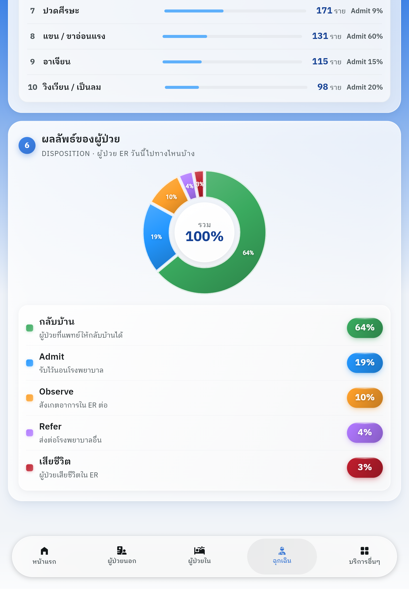
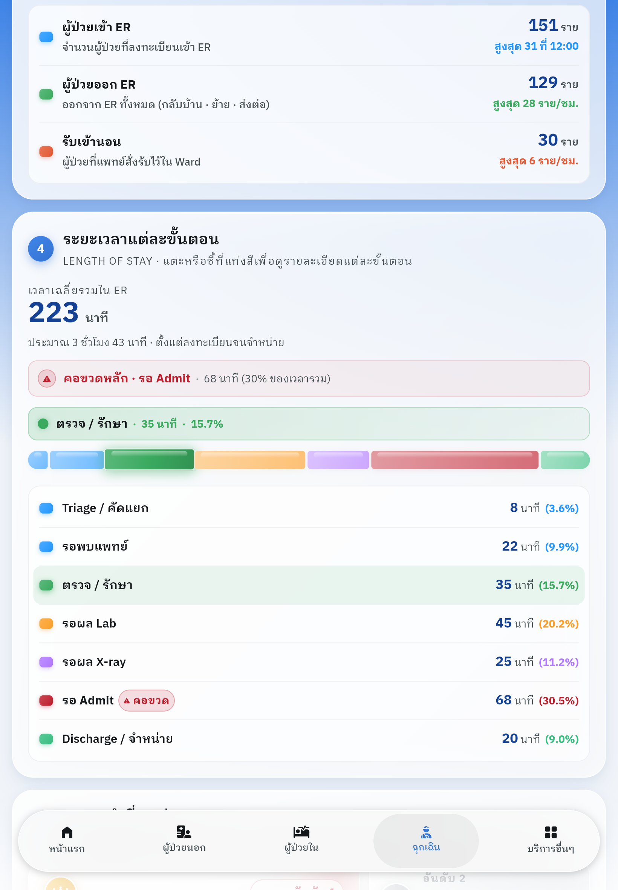
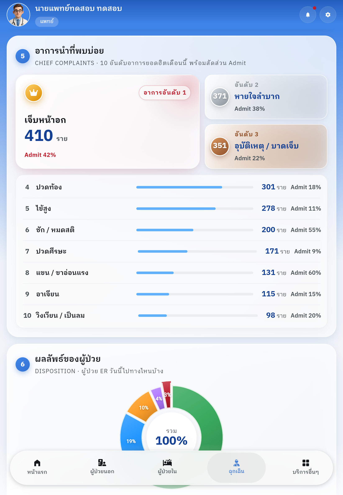
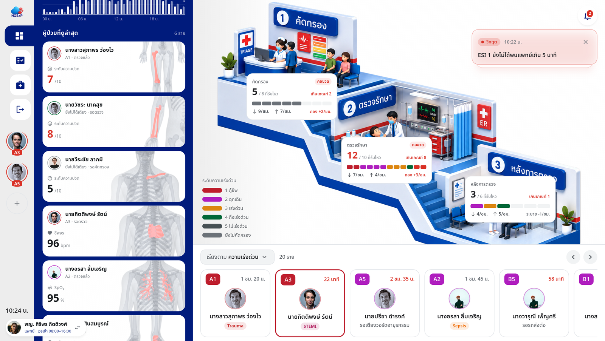
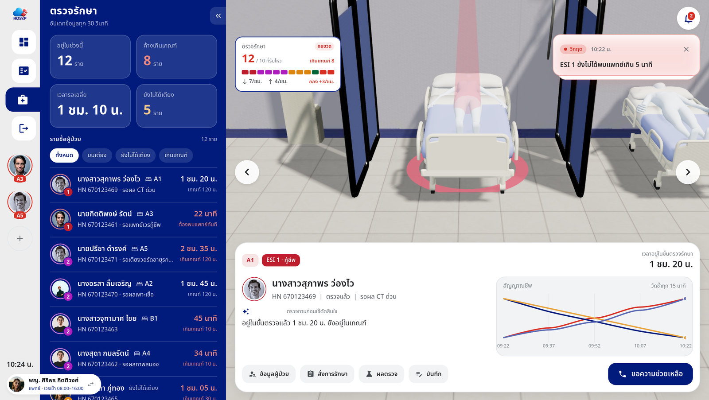
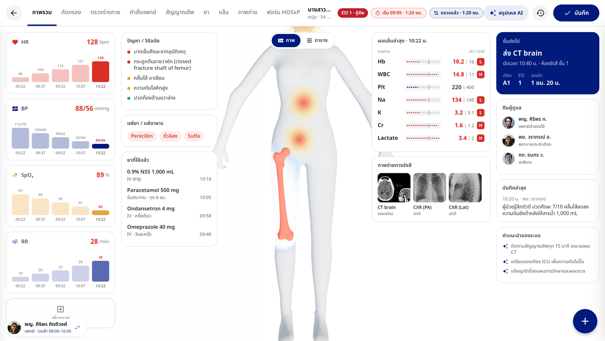
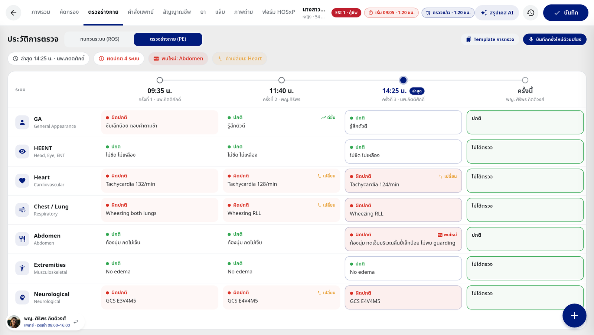
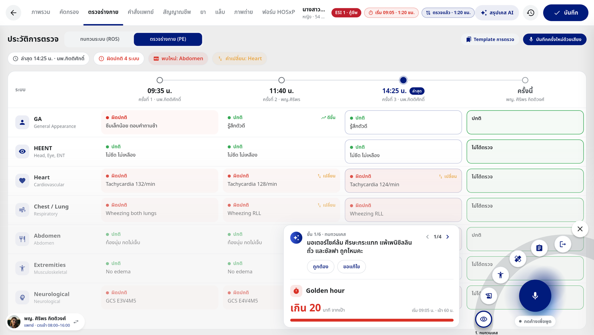

# HOSxP Plus V5 — ER Dashboard

UX/UI prototype for the Emergency Room (ER) executive dashboard of a Thai hospital, built on top of the HOSxP Plus V5 Flutter app.

**Live demo:** https://bms-uxui.github.io/bms-hosxp-plus/

## Scope

This repo is focused on **visual design + interaction prototyping**. Data is mocked locally; Supabase wiring is out of scope for this phase.

Covered dashboard sections (6 of 10 from the spec):

1. **KPI Overview** — 8 key metrics, responsive 1/2/4-column grid
2. **Triage Classification** — 5-level segmented bar + interactive legend
3. **Patient Flow** — 24h horizontally scrollable line chart with current-time indicator
4. **Length of Stay (LOS)** — 7-step journey as segmented bar with bottleneck highlight
5. **Chief Complaints** — Hero + top-3 + detailed list for top-10 complaints
6. **Disposition** — Donut chart with interactive legend

## Design direction

- **Glassy + 3D** aesthetic: translucent gradients, `BackdropFilter` blur, layered shadows, gloss strips
- **Thai-primary** UX writing, supportive English secondary labels
- Tab-based navigation with dedicated **แดชบอร์ด** tab alongside the patient list tabs

## Screenshots

### ตัวชี้วัดสำคัญ (KPI Overview)


### แยกตามระดับความเร่งด่วน · กระแสผู้ป่วยรายชั่วโมง (Triage + Patient Flow)


### ระยะเวลาแต่ละขั้นตอน (Length of Stay)


### อาการนำที่พบบ่อย (Chief Complaints)


### ผลลัพธ์ของผู้ป่วย (Disposition)


## ER workflow redesign (tablet)

Redesign of the ER working screens for doctors, nurses and triage nurses on a tablet, with a 3D patient body and a Thai voice assistant ("น้องช่วย"). Domain rules and design decisions are kept in [docs/knowledge.md](docs/knowledge.md).

> **Design language:** anyone continuing this module (human or AI) must follow [docs/design-rules.md](docs/design-rules.md) — colors, type, shape, gloss, motion, workflow and performance rules.

### ภาพรวมห้องฉุกเฉิน (ER flow home)
Isometric view of the ER journey (triage → treatment → post-treatment) with live counts, over-limit alerts and a patient strip sorted by urgency.


### มุมมองเตียง (Bed view)
3D bed scene per patient with the stage card, vital-sign trend and quick actions.


### รายละเอียดผู้ป่วย (Patient detail)
Vital-sign trends, problems, allergies, medications, latest labs with H/L flags, imaging and next step around a 3D body (BodyParts3D) that highlights injured bones and symptom areas.


### ประวัติการตรวจร่างกาย (Exam timeline)
ROS / PE log across exam rounds so the doctor can compare changes (new, changed, improved) and continue recording in the "ครั้งนี้" column.


### ผู้ช่วยบันทึกด้วยเสียง (Voice agent)
Push-to-talk assistant that walks each role through its HOSxP forms step by step, fills fields from speech, and asks for confirmation before saving.


### Latest additions
- **Patient overview (bento)** — follow-up tasks, AI chief-complaint summary, abnormal vital signs as red cards with monotone trend charts, lab/order red dots for new results.
- **Re-measure vital signs** — right drawer with real-time voice entry; doctors can schedule repeat rounds for nurses.
- **Order Set** — card picker, and the snake-bite paper order set digitized (branch card, lab hints, antivenom safety, assessment rounds, paper view).
- **3D body labels** — each point shows its source (DX / PE / CC / wound); sex-specific figure; wound photos with full-screen viewer.
- **Register new patient** — identity-only form (triage data stays in the workflow), unknown-patient option, allergy chips, ID-card read (mock).
- **Face-scan search** — front camera → closest matches with similarity; the user always confirms before opening a case (matching is mock).
- **F9 hand-off** — HOSxP-style drawer to send the patient to the next flow: room, status, pending payment, drug count.
- **Workflow** — jumps to the review page when a step is complete or skipped; mic voice-activity fix.

### To-do
- [ ] Connect face matching, ID-card reader and billing to real services (currently mock)
- [ ] Save registration details (allergy, blood group, DOB) into the case record

## Stack

- Flutter 3.41.5 / Dart 3.11.3 (stable)
- `fl_chart` for bar / line / pie charts
- `flutter_staggered_grid_view` for the KPI grid
- Hosted as a static build on GitHub Pages; auto-deployed by a GitHub Actions workflow on every push to `main`

## Running locally

```bash
flutter pub get
flutter run -d chrome          # or: flutter run -d web-server --web-port=8787
```

## Deploying

Push to `main`. The `.github/workflows/deploy.yml` workflow builds `flutter build web --release` and publishes to GitHub Pages automatically (~3 min).
